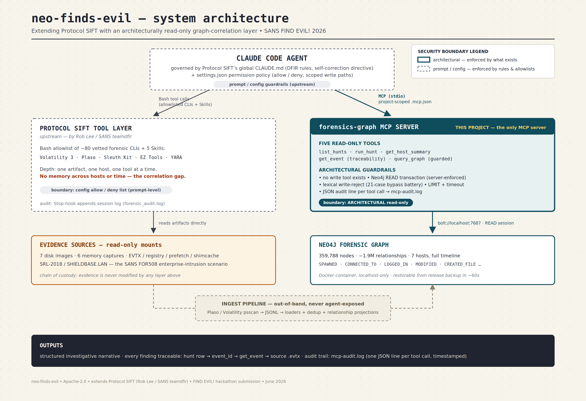

# neo-finds-evil — a read-only graph-correlation layer for AI-driven DFIR

**SANS "FIND EVIL!" hackathon submission.** A read-only **Neo4j graph-correlation layer** that **extends [Protocol SIFT](https://github.com/teamdfir/protocol-sift)**. Protocol SIFT gives a Claude Code agent *per-artifact* forensic tools (Volatility, Plaso, Sleuth Kit, EZ Tools, YARA) — deep on one artifact at a time, but with **no memory across hosts or time**. This project adds the missing layer: a graph of *every* artifact across *every* host over the *whole* timeline, exposed to the same agent as **architecturally read-only MCP tools** so it can reason **across hosts and across time** — lateral movement, cross-host tool reuse, credential-theft chains — that no single-tool output can show.

> The five MCP tools are **read-only by construction**: the server registers no write tool, and the one free-form query path (`query_graph`) runs inside a Neo4j READ transaction that the driver itself refuses to let write. See [Security boundaries](#the-architectural-read-only-guardrail).

---

## The problem

Modern IR runs at machine speed, and an LLM agent can drive forensic CLIs faster than an analyst can type. But each CLI invocation is an **island**: `vol.py` dumps one machine's processes; `EvtxECmd` parses one host's event log; `log2timeline` builds one image's timeline. The evidence that matters in an enterprise intrusion lives *between* those islands — the same tool reused on six hosts, an account brute-forced on one host and succeeding on another, a credential dumper staged here and a SAM hive copied there. A per-artifact agent literally **cannot express** those questions, because the correlation never exists in any one tool's output.

`neo-finds-evil` closes that gap by normalizing all artifacts into one **Neo4j graph** (hosts × processes × events × files × registry × network × accounts × time) and handing the agent a small, vetted set of **read-only** correlation tools over it.

---

## Submission compliance

Every FIND EVIL! required component and exactly where to find it:

| Required component | Location |
|---|---|
| Public code repository | this repo — *pending: public GitHub mirror (URL added at submission)* |
| Open-source license | [`./LICENSE`](./LICENSE) — Apache-2.0 |
| README with setup instructions | this file — [Setup / Run](#setup--run-judge-runbook) |
| Step-by-step run instructions | this file — [Setup / Run](#setup--run-judge-runbook) |
| Text description of features | this file (above) + [`docs/`](./docs/) |
| Demonstration video | *pending — link added at submission* |
| Architecture diagram | [`docs/architecture.png`](docs/architecture.png) (described in [`docs/architecture.md`](docs/architecture.md)) |
| Evidence Dataset Documentation | [`docs/evidence-dataset.md`](docs/evidence-dataset.md) |
| Accuracy Report | [`docs/accuracy-report.md`](docs/accuracy-report.md) |
| Agent Execution Logs | [`docs/execution-logs/`](docs/execution-logs/) |

---

## Architecture



*The Claude Code agent runs under Protocol SIFT's operating rules. Protocol SIFT contributes the per-artifact Bash/Skill tool layer over read-only evidence mounts; this project contributes the **only MCP server** — `forensics-graph`, five read-only tools over the Neo4j correlation graph. The agent gains cross-host/cross-time reasoning without gaining any write path to evidence or graph.*

Full written description, data/control flow, and the architectural-vs-prompt guardrail analysis: **[docs/architecture.md](docs/architecture.md)**.

---

## How this maps to the FIND EVIL! required demonstrations

| Required demonstration | Where it's evidenced |
|---|---|
| **Self-correction** | Every MCP tool returns *typed* errors (`unknown_hunt`, `write_rejected`, `timeout`, `unknown_host`, `not_found`, …) with a *what-to-do-instead* message, so the agent corrects its own call instead of giving up. A **real, logged** self-correction run (empty result → schema discovery → corrected query → traceable event) is in **[docs/execution-logs/](docs/execution-logs/)**; see also `docs/protocol-sift-integration.md` §5.1. |
| **Accuracy / traceability** | `get_event(event_id)` resolves any finding back to its **source `WindowsEvent`** (channel = the source `.evtx`), and per-event hunts carry `event_id` + `channel`, giving an unbroken *hunt row → event id → source artifact* chain. Honest accuracy self-assessment — confirmed vs. inferred, and **errors we caught and corrected** — in **[docs/accuracy-report.md](docs/accuracy-report.md)**. |
| **Analytical reasoning (cross-host / cross-time)** | The core contribution. The graph correlates all 7 hosts + the full timeline; `run_hunt` / `query_graph` answer questions no single SIFT tool can — lateral movement, cross-host tool reuse, the Empire → PsExec → SAM-theft chain. Dataset + headline findings: **[docs/evidence-dataset.md](docs/evidence-dataset.md)**. |
| **Architectural (not prompt-based) guardrails** | The read-only guarantee is a **property of the server**, not a prompt: no write tool is registered, and `query_graph` runs in a Neo4j READ transaction (`default_access_mode=READ`) that rejects writes regardless of text. See [below](#the-architectural-read-only-guardrail) and **[docs/architecture.md](docs/architecture.md)** → *Security boundaries*. |

### The architectural read-only guardrail

Three layers, in order of strength:

1. **No write tool exists.** The MCP server registers exactly five tools — `list_hunts`, `run_hunt`, `get_host_summary`, `get_event`, `query_graph` — all read-only. The agent has **no MCP affordance** to `CREATE`/`MERGE`/`SET`/`DELETE`. This is a property of the tool surface, not a rule the agent is asked to follow.
2. **`query_graph` runs in a READ transaction.** The one free-form path opens its session with `default_access_mode=READ` and an explicit read transaction — **the Neo4j driver/server refuses any write**, regardless of the query text. This is the true boundary.
3. **Lexical pre-check + resource bounds (defense in depth).** A comment-stripped, whole-word check rejects `CREATE/MERGE/DELETE/SET/REMOVE/DROP/DETACH/FOREACH`, `LOAD CSV`, `CALL { … } IN TRANSACTIONS`, and apoc/db write procedures *before* execution; every query is wrapped with a server-side timeout and a mandatory `LIMIT`. (This lexical guard intentionally **over-rejects** — see [Known limitations](#known-limitations--future-work).)

A live write-rejection (the agent tried `MATCH (n) DETACH DELETE n`) and its audit-log line are shown in `docs/protocol-sift-integration.md` §4.0.

---

## Setup / Run (judge runbook)

### Prerequisites

- **SANS SIFT Workstation** (or any Linux host) with **Docker**.
- **Claude Code** (`claude` on PATH).
- **[uv](https://docs.astral.sh/uv/)** (Python package/lock manager).
- **Protocol SIFT** (the framework this extends).

### 1. Install Protocol SIFT

Protocol SIFT configures Claude Code for DFIR (it copies a global `CLAUDE.md`, a permission policy, and skill playbooks into `~/.claude/`). Install per its own instructions:

```bash
curl -fsSL https://raw.githubusercontent.com/teamdfir/protocol-sift/main/install.sh | bash
```

> **Heads-up (we hit this):** the installer **overwrites** `~/.claude/{CLAUDE.md,settings.json,settings.local.json}` (backing them up to `.bak-<ts>` first). If you already use Claude Code, back up `~/.claude/` first, or inspect `install.sh` before running. This project registers its MCP server **per-project** via a committed `.mcp.json`, specifically so it never fights Protocol SIFT's global config. Details: `docs/protocol-sift-integration.md` §0/§6.

> **Independence note.** The `forensics-graph` MCP server and the correlation graph are self-contained and run **independently of Protocol SIFT**. Protocol SIFT provides the per-artifact forensic tools this project complements and extends; installing it is required to reproduce the full agent environment, but the graph layer itself does not depend on it.

### 2. Clone this repo and sync dependencies

```bash
git clone <your-fork-url> neo-finds-evil && cd neo-finds-evil
uv sync                      # installs deps incl. the `mcp` SDK and the neo4j driver
```

### 3. Restore the forensic graph

The graph is published as a release asset (it is far too large, and is evidence, to live in git):

```bash
# Download the release asset:  graph-srl2018.tar.gz
# It contains a pre-ingested Neo4j /data directory for the SRL-2018 case.

mkdir -p ~/neo4j-data
tar -xzf graph-srl2018.tar.gz -C ~/neo4j-data       # → ~/neo4j-data/for508 (databases + transactions)

# Start Neo4j 5.x Community over that data directory (matches the .mcp.json bolt/creds):
docker run -d --name neo4j-forensics \
  --restart unless-stopped \
  -p 7474:7474 -p 7687:7687 \
  -v ~/neo4j-data/for508:/data \
  -e NEO4J_AUTH=neo4j/forensics123 \
  -e 'NEO4J_PLUGINS=["apoc"]' \
  neo4j:5-community

# Wait for bolt, then sanity-check the node count:
until docker exec neo4j-forensics cypher-shell -u neo4j -p forensics123 "RETURN 1" >/dev/null 2>&1; do sleep 2; done
docker exec neo4j-forensics cypher-shell -u neo4j -p forensics123 "MATCH (n) RETURN count(n) AS nodes"
# expect ~359,788 nodes
```

> `forensics123` is the **documented localhost demo-container password** for this self-contained graph. It is not a secret and is not reused for anything else; the container binds to `127.0.0.1` only.
>
> **Note — credentials are baked into the restored data dir.** The restored data directory already contains its credentials (`neo4j` / `forensics123`), so `NEO4J_AUTH` is **ignored when starting over an existing store** — this is expected, and the baked password is what `.mcp.json` and the sanity-check commands use. To change it (e.g. before exposing the port), use an in-database `ALTER USER` and update `.mcp.json`'s `NEO4J_PASSWORD` — editing `NEO4J_AUTH` alone will not work on a restored store.

### 4. Register the MCP server

The committed **`.mcp.json`** at the repo root auto-registers the server when you launch `claude` from this directory:

```json
{ "mcpServers": { "forensics-graph": {
    "command": "uv", "args": ["run", "--quiet", "forensics-mcp"],
    "env": { "NEO4J_URI": "bolt://127.0.0.1:7687", "NEO4J_USER": "neo4j",
             "NEO4J_PASSWORD": "forensics123", "NEO4J_DATABASE": "neo4j",
             "FORENSICS_MCP_AUDIT": "investigation/mcp-audit.log" } } } }
```

Or register it explicitly:

```bash
claude mcp add --transport stdio forensics-graph -- uv run forensics-mcp
```

### 5. Launch the agent and ask a cross-host question

```bash
claude
```

Then paste a question the graph can answer but a per-artifact tool cannot — the **`spsql` cross-host trace**:

> *"The account `spsql` was brute-forced in this case. Using only the `forensics-graph` MCP tools, trace its activity across all hosts — where did it log in, what is it associated with, and pull one specific source event via `get_event` to anchor the evidence trail."*

The agent will discover the schema, run a cross-host correlation, and resolve a single failed-logon event (e.g. `SRL-DMZFTP:74648`) back to its source `.evtx` — the exact trace recorded in **[docs/execution-logs/](docs/execution-logs/)**.

> **What you'll see — an empty first result is expected.** The agent typically probes the graph schema first; an initial empty result followed by a corrected query is **intended self-correction**, not an error. `spsql` is not a `UserAccount` node — it lives as the `targetUser` property on `WindowsEvent` nodes, and the relevant property keys are `computer` / `id` / `eventId` (not `host` / `event_id`). To reproduce the headline result directly, the productive cross-host view groups `spsql` events by host and event id:
>
> ```cypher
> // via query_graph — spsql activity correlated across hosts
> MATCH (e:WindowsEvent)
> WHERE e.targetUser = 'spsql'
> RETURN e.computer AS host, e.eventId AS eventId, count(*) AS events
> ORDER BY host, eventId
> ```
>
> This surfaces the brute force — `4625` failures on `SRL-DMZFTP` from `172.16.4.5` — then the follow-on `4624` successes and `4688` process-creates across `SRL-DC`, `SRL-FILE`, `SRL-RD01`, `SRL-RD02`, and `SRL-WKSTN05`. Prefer this over the `failed_logons` hunt, whose top rows are dominated by `BASE-HUNT$` machine-account noise.

---

## MCP tool reference

All five tools are read-only. Source: `src/forensics/mcp_server.py`; design notes in `docs/protocol-sift-integration.md` §4.

| Tool | Signature | Returns |
|---|---|---|
| `list_hunts` | `() -> [ {name, category, description} ]` | All 31 vetted hunts (categories like `credential_access`, `lateral_movement`, `persistence`, `c2_network`, `execution`). |
| `run_hunt` | `(name: str, limit: int = 100) -> {hunt, rows, row_count, truncated, duration_ms}` | Runs a **named, vetted** hunt. Validates `name`; rejects case-param hunts; read-tx + server timeout; rows capped. The safe default interface. |
| `get_host_summary` | `(hostname: str) -> {hostname, total_events, process_count, events_by_event_id[], relationship_counts{…}}` | Per-host orientation via anchored counts. Lists valid hosts if the name is unknown. |
| `get_event` | `(event_id: str) -> {event_id, event{…all props…, host}}` | **Traceability primitive.** Resolves a finding to its source `WindowsEvent` (incl. `channel` = source `.evtx`). Id scheme: `<HOSTNAME>:<record_number>` (e.g. `SRL-DC:2952977`). |
| `query_graph` | `(cypher: str, params=None, limit_enforced: int = 100) -> {rows, row_count, truncated, limit_applied}` | Guarded read-only escape hatch for ad-hoc reasoning. **Writes are rejected** (READ transaction + lexical pre-check); mandatory `LIMIT`; server-side timeout. |

---

## Repository layout

```
neo-finds-evil/
├── .mcp.json                 # project-scoped MCP registration (auto-detected by Claude Code)
├── pyproject.toml            # entry points: forensics-mcp (the MCP server), forensics-ingest
├── uv.lock
├── LICENSE / NOTICE          # Apache-2.0
├── README.md                 # this file
├── config/
│   └── exclusions.yaml       # behavioral-hunt denylists/dictionaries (required by 2 hunts)
├── src/forensics/
│   ├── mcp_server.py         # ★ the read-only forensics-graph MCP server (5 tools)
│   ├── hunt.py               # the vetted hunt catalog (QUERIES) behind run_hunt/list_hunts
│   ├── neo4j_client.py       # read-only query client (read-tx, timeout, retry)
│   ├── ingest/               # Phase-1 pipeline that builds the graph (loaders per artifact type)
│   └── …                     # normalization, coverage, correlation, playbooks
├── tests/                    # full suite incl. test_mcp_server.py (write-rejection bypass battery)
└── docs/
    ├── architecture.md       # components, data/control flow, SECURITY BOUNDARIES
    ├── architecture.png      # (supplied separately) the diagram referenced above
    ├── evidence-dataset.md   # the SRL-2018 / FOR508 dataset + graph scale + headline findings
    ├── accuracy-report.md    # honest self-assessment: confirmed vs inferred; errors caught
    ├── protocol-sift-integration.md   # recon of Protocol SIFT + how/why we extend it
    └── execution-logs/       # sanitized agent tool-execution log sample + format guide
```

---

## Known limitations & future work

- **Neo4j Community is single-database / single-user.** A true read-only DB *role* isn't really available on Community, so the **tool layer (and the READ transaction) is the enforced boundary** — by design, and tested hard (see `tests/test_mcp_server.py`).
- **Engine portability.** Hunts are expressed in Cypher; porting to another graph engine means re-expressing the `QUERIES`. The tool *contract* (the five MCP tools) is engine-agnostic.
- **Aggregate-hunt traceability.** Per-event hunts carry `event_id` + `channel` for direct `get_event` traceback; aggregate/count hunts (e.g. `event_coverage`, `lateral_tool_reuse`) return host + key sufficient for a follow-up `get_host_summary` / `query_graph`, but are not per-event by nature.
- **EID 10 (Sysmon ProcessAccess) is contentless in this graph.** `SourceImage`/`TargetImage`/`GrantedAccess` were not parsed into node properties this load, so LSASS-targeting credential access can't be confirmed from the graph alone (it's established independently). See `docs/accuracy-report.md`.
- **The `query_graph` lexical guard over-rejects.** A benign query containing a write *keyword* as a substring/identifier can be refused. This is **intentional**: for a read-only forensic server, over-rejection is the safe direction, and the READ transaction — not the lexical list — is the real guarantee.

---

## Credits

- Built to **extend Protocol SIFT by Rob Lee / SANS / teamdfir** — the AI-driven DFIR framework for the **SANS SIFT Workstation**.
- Runs on the **SANS SIFT Workstation** and the **Neo4j** graph database (Community Edition).
- Evidence is the publicly published **SANS FOR508** lab scenario (Stark Research Labs / SHIELDBASE) — see `docs/evidence-dataset.md`. All names/IPs/indicators are training-scenario artifacts, not real persons or infrastructure.

Licensed under **Apache-2.0** (see `LICENSE`, `NOTICE`).
